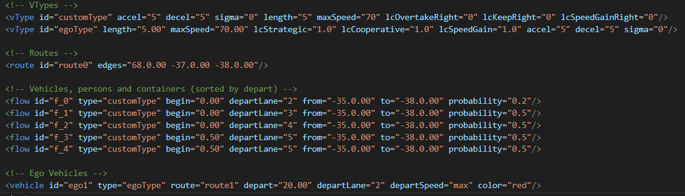

# OpenCDA-Merging

A fork of the OpenCDA repo  [original documentation](BASE_README.md) that contains custom Co-Simulation scenarios running CARLA and SUMO integrated with OpenCDA.

### Users Guide
* [Installation](#Installation)
* [Creating a Custom Scenario](#Creating-a-Custom-Scenario)

### Scenarios (SUMO/CARLA)
* [Highway Ramp Merging](#highway-ramp-merging)

# Installation

TODO: Installation instructions

# Creating a Custom Scenario

TODO: Instructions

# Scenarios

## Highway Ramp Merging

<video width="640" height="360" controls>
  <source src=".\docs\videos\Highway_Merging.mp4" type="video/mp4">
  Your browser does not support the video tag.
</video>

Here we can see an example scenario of an ego vehicle attempting to merge onto a busy freeway. Traffic behavior is fully generated by the SUMO simulator and described by opencda\assets\Merging\Merging.rou.xml

[Link to code](opencda\assets\Merging\Merging.rou.xml)

Below is a snippet of the code describing vehicle behavior:

### 1. vType: [Link to Official Documentation](https://sumo.dlr.de/docs/Definition_of_Vehicles%2C_Vehicle_Types%2C_and_Routes.html#vehicle_types)

Defines a vehicle type with properties that can be inherited by other either flows or individual vehicles.

#### Parameters
- lcOvertakeRight - 
- lcKeepRight - 
- lcSpeedGainRight - 

### 2. Route

#### Parameters
- edges - a list of edges that defines a route

### 3. Flow

Defines a SUMO flow, a stream of vehicles that will be generated with the given parameters

#### Parameters
- begin - time (in seconds) from the simulation start to spawn the vehicle
- from - the start node for a route
- to - the end node for a route
- probability - the % chance on every simulation tick that a new vehicle is spawned

### 4. Vehicle

#### Parameters

### Town6 Relevant Edges

A SUMO map is made up of edges connected at junctions. The edge id is required to define a route that a vehicle will follow. A route is a sequence of edges that a vehicle will pass through. For reference the relevant edges on the Town6 map are labeled below.

