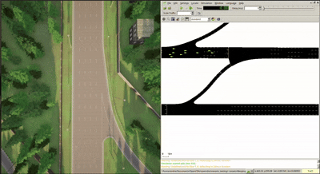
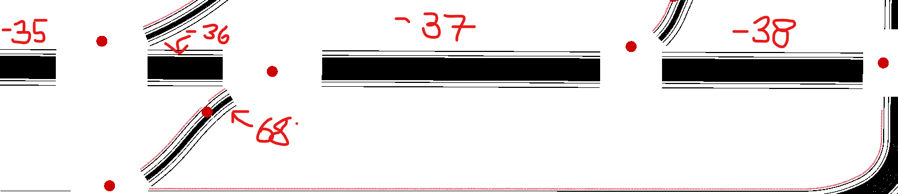

# OpenCDA-Merging

A fork of the OpenCDA repo — see the [original documentation](BASE_README.md) — that contains custom Co-Simulation scenarios running CARLA and SUMO integrated with OpenCDA.

---

## Users Guide
* [Installation](#installation)

## Co-Simulation Scenarios
* [Highway Ramp Merging](#highway-ramp-merging)

---

# Installation

Here is a link to the official documentation for refrence [link](https://opencda-documentation.readthedocs.io/en/latest/md_files/installation.html). Be aware that I was not able to get this codebase to work by following the documentation exactly and had to follow the path described below.

## System Requirements

This build was testing with the following specs
* <b>System Requirements:</b> Ubuntu 24.04
* <b>Adequete GPU</b> 8GB recommended by docs but the simulation will run (poorly) on a system without a GPU like mine
* <b>Python Version</b>: <span style="color: orange">todo</span>

## Building Carla (0.9.12)

This repo was tested with Carla version `0.9.12`. Download here: [link](https://github.com/carla-simulator/carla/releases)

* The AdditionalMaps_0.9.12.tar.gz also need to be downloaded and extract to the CARLA repo to support scenario testings in Town06. 
* Building from source is not required

## OpenCDA Installation

First, download OpenCDA github to your local folder if you haven’t done it yet.

```
git clone https://github.com/ucla-mobility/OpenCDA.git
cd OpenCDA
```

Make sure you are in the root dir of OpenCDA, and next let’s install the dependencies. We highly recommend use conda environment to install.

```
conda env create -f environment.yml
conda activate opencda
python setup.py develop
```

If conda install failed, install through pip

```
pip install -r requirements.txt
```

After dependencies are installed, we need to install the CARLA python library into opencda conda environment. You can do this by running this script:
```
export CARLA_HOME=/path/to/your/CARLA_ROOT
export CARLA_VERSION=0.9.12
. setup.sh
```

## SUMO Installation (Required for co-simulation)

You can install SUMO directly by apt-get:

```
sudo add-apt-repository ppa:sumo/stable
sudo apt-get update
sudo apt-get install sumo sumo-tools sumo-doc
```

After that, install the traci python package.

```
pip install traci
```

Finally, add the following path to your ~/.bashrc:

```
export SUMO_HOME=/usr/share/sumo
```

# Scenarios Descriptions

## Highway Ramp Merging

<!-- <video width="640" height="360" controls>
  <source src="https://raw.githubusercontent.com/andrearante12/OpenCDA-Merging/main/docs/videos/Highway_Merging.mp4" type="video/mp4">
  Your browser does not support the video tag.
</video> -->



**Direct video link:**  
[docs/videos/Highway_Merging.mp4](docs/videos/Highway_Merging.mp4)

Here we can see an example scenario of an ego vehicle attempting to merge onto a busy freeway.

## Running the simulation locally

In the root directory of this repo run
```
conda activate opencda
python opencda.py -t merging  -v 0.9.12 
```

---

## Important Files that Describe the Simulation  
(See official docs: https://opencda-documentation.readthedocs.io/en/latest/md_files/logic_flow.html)

---

## 1. SUMO Simulation (`merging.rou.xml`)

SUMO is utilized to generate the background traffic for the simulation.

➡️ [opencda/assets/Merging/Merging.rou.xml](opencda/assets/Merging/Merging.rou.xml)

---

## 2. Simulation Server Configuration (`merging.yaml`)

This YAML file configures:

- Server parameters (sync vs async mode)  
- Traffic flow and human-driven vehicle configuration  
- Connected Automated Vehicle (CAV) parameters  
- Sensor settings (LiDAR, detection model, trajectory smoothing)

➡️ [opencda/scenario_testing/config_yaml/merging.yaml](opencda/scenario_testing/config_yaml/merging.yaml)

---

## 3. OpenCDA Integration (`merging.py`)

This Python script is the main entry point for running the merged SUMO–CARLA scenario.

➡️ [opencda/scenario_testing/merging.py](opencda/scenario_testing/merging.py)

---

# Town06 Relevant Edges

A SUMO map is made up of edges connected at junctions.  
The **edge ID** is required to define vehicle routes (a sequence of edges).  
The relevant edges in CARLA Town06 are labeled below.


